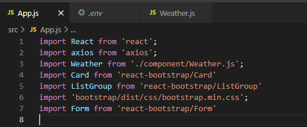
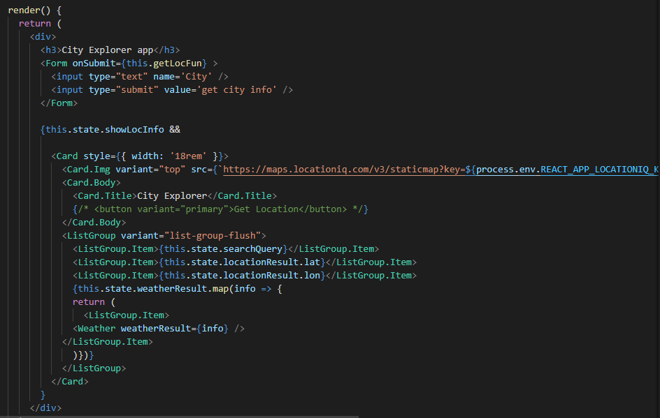
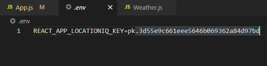
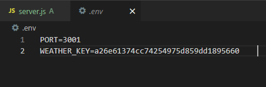
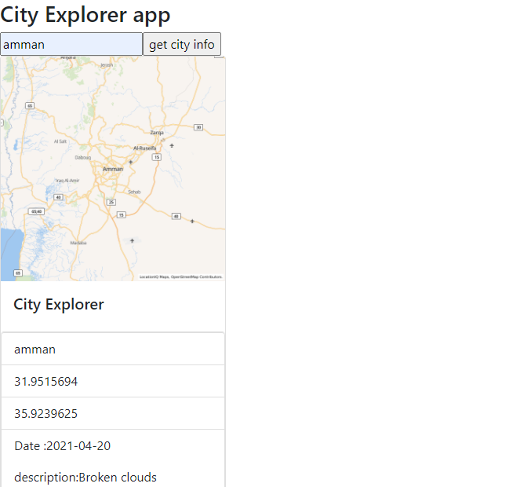
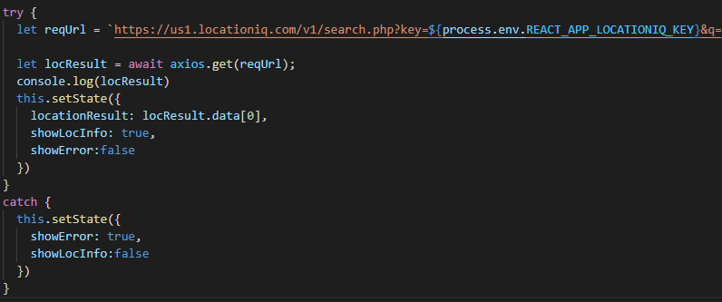
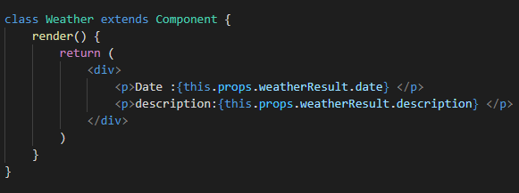

# White box testing

Here is the all libraries we needed to implement the code.
   

This is the render to print the results in a card as a form.
   

My own key for the locationIQ.
   

My own key for the weatherbit.
   

Test the results when enter a value.
   

To check if there is an error or not.
   

This bring the data and return it to print them in the form.
