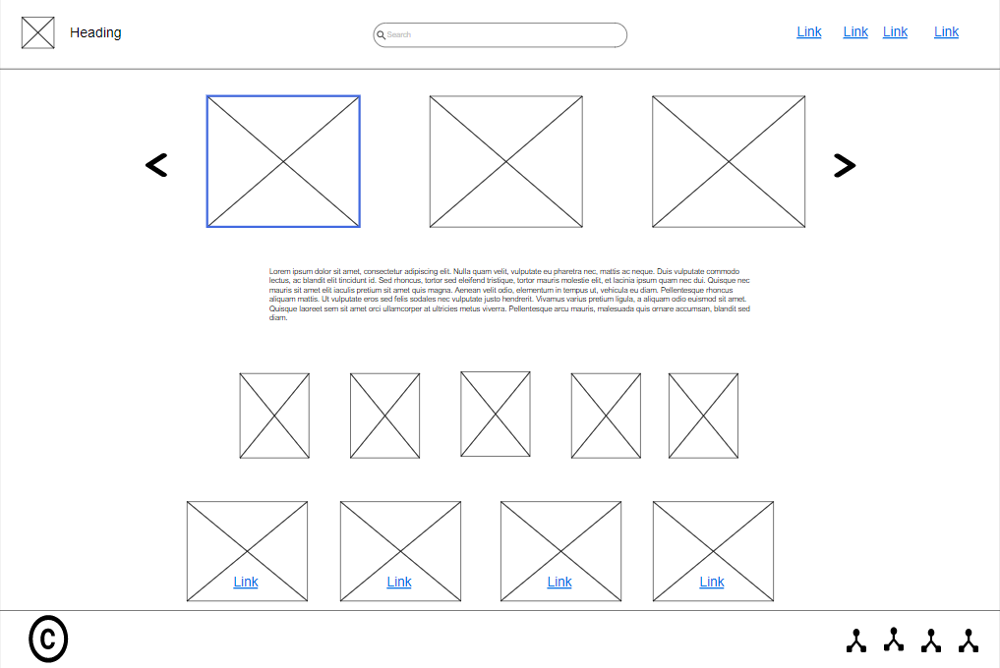
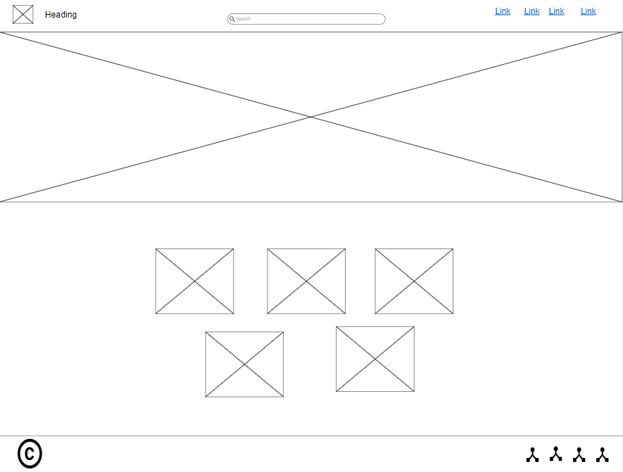
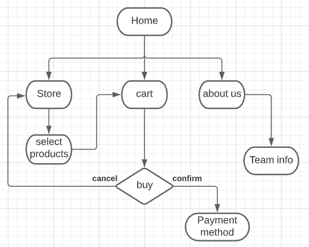

# Stage 1

## task 1

1-

At the first we disscused to find a problem in our society to get a solution for it. So we talked about handcraft items with it's extentions and what can we do.

Then we've reached to a several points which we can handle with thim to provide a good service to the customer.

We can start to say that we are the first website for handcraft items that shows you all the products in the site from deffirent stores, also We are distinguished by the pay method that you can pay online by (visa, mastercard) and your order will be delivered for you.

This website has been developed to increase the markiting and the sales for the stores or the people who has handcraft skills, because by the online website it will reach to the maximum number of people.

one of the advantages in our website that the design is beautiful also very clear and simple, that means anyone can use the site without problems with the pages or style.

2-

Of course there are many risks may face any team during the work on the project, so I will list a group of points about these risks:

* **Time management:** this risk is one of the most issues which face the team, because if they arn't agree with each other about who will do the task and when should be finished, it will make a big problem and conflict.

* **Team leader and the communication:** the most important thing to organize the work is to choose a leader for the team. the importance of team leader lies in how he will devide the tasks and how he will organize the communication between the team members, to avoid the troubles between them.

* **Change the requirements from the customer:** this risk may happen with any project if the customer wants to change some feastures in the site. This risk will affect many related points like the deadline of the project, of course you will be late to finish it at the time. Also it will affect on the budget of the project, because every thing in the project has an specific budget.

3-

### **The list of requirements:**

* The system should be easy to use because it an online store.

* The main page should have a review about the site and links to other pages.

* Because we have many products, there should be a list of categories to divide the product to a sections in the store page.

* The site should have a cart shopping with all specific details of the purchases.

* It must has an online payment method as it's an online shopping.

 

### **Wireframe:**

* Home Page

* Store page

* About Us page

* Cart page

 

### **Diagram:**

### **Coding technique:**

* Why we used waterfall in our project

The Waterfall methodology, being an internal procedure, places little emphasis on the end user or customer participating in a project. Its primary goal has always been to assist internal teams in moving more quickly through project phases, which is ideal for the software industry.

* What is the diffirence between **waterfall** and **agile** model

To put it another way, Waterfall is about establishing a strong plan and sticking to it, whereas Agile is about being more flexible and iterative. Agile is more customizable as a project evolves, whereas Waterfall is more sequential and pre-defined.

Agile is a set of concepts rather than a specific methodology.

 

### **Testing technique:**

We followed the **Black Box** technique as a testing method, this technique is simply when you use the system as a user. That means we tested it regardless of the code or how it goes, because we focused on the behavioural of the system like the if the buttons will take you to the right page you chose, also when you choose the products then stored in the cart page.

And the most important thing is the calculation for the total price of the products without any mistakes.

## References

* Aipm.com.au. 2021. Agile vs Waterfall – What’s the Difference?. [online] Available at: <https://www.aipm.com.au/blog/agile-vs-waterfall-whats-the-difference> [Accessed 24 August 2021].
